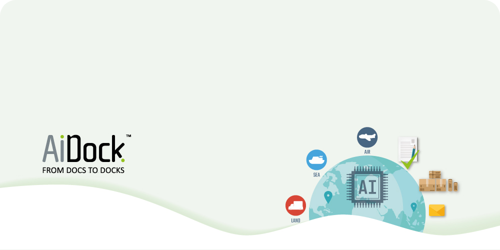

<h1 style="font-size:40px">Welcome To AiDock 
</h1>

Our vision at AiDock is to transform the global supply by creating a seamless, efficient and reliable system powered by our innovative virtual workforce.  
We strive to lead the charge in AI technology and become the benchmark for customs innovation, improving the lives of individuals and businesses alike.

<h2 align="left">Contact Us 📞</h2>

    
    
    
    
    

<!--

**Here are some ideas to get you started:**

🙋‍♀️ A short introduction - what is your organization all about?
🌈 Contribution guidelines - how can the community get involved?
👩‍💻 Useful resources - where can the community find your docs? Is there anything else the community should know?
🍿 Fun facts - what does your team eat for breakfast?
🧙 Remember, you can do mighty things with the power of [Markdown](https://docs.github.com/github/writing-on-github/getting-started-with-writing-and-formatting-on-github/basic-writing-and-formatting-syntax)
-->
